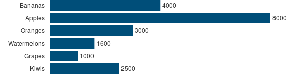
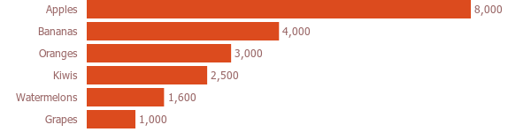

# pyrecharts

## Description

pyrecharts (Python Ready Charts) is an opinionated charting library for easy reporting in Jupyter Notebooks and scripts, considering visualization and business communication best practices and standards. 

**TODO**:

- [ ] Include title, source and paper options in saved image
- [ ] More charts: line, dotplot, variance, waterfall, etc.
- [ ] Create and register package to use with pip

## Installation

Clone repository or download **pyrecharts** folder. Fire up your script or notebook. See **pyrecharts.ipynb** for more examples.

## Usage

```python
import sys
import os
sys.path.append(os.path.join(os.getcwd(),'pyrecharts'))

from IPython.display import display,HTML

from pyrecharts import StdCharts
```
### Default options

```python
data = dict(
    labels=['Bananas','Apples','Oranges','Watermelons','Grapes','Kiwis'],
    values=[4000,8000,3000,1600,1000,2500]
)
out = StdCharts.HBar(data)
HTML(out)
```


### Extended

```python
data = dict(
    labels=['Bananas','Apples','Oranges','Watermelons','Grapes','Kiwis'],
    values=[4000,8000,3000,1600,1000,2500]
)
out = StdCharts.HBar(
    data = data,
    width=600,
    color='#996666',
    title='Fruit prices ($)',
    source='Source: Local Market',
    fill='rgb(220, 75, 30)',
    values_sorted=True,
    paper='#f6f6f6',
    locale='en',
    font='Tahoma')
HTML(out)
```



Only `es-ES` and `en` locales supported. Fonts supported: Arial, Tahoma, Helvetica, Georgia, sansserif.

**NOTE**: `title`, `source` and `paper` options ony visible within Jupyter Notebooks.

## License

MIT License

Copyright (c) 2017 Rodrigo Abt

```
Permission is hereby granted, free of charge, to any person obtaining a copy
of this software and associated documentation files (the "Software"), to deal
in the Software without restriction, including without limitation the rights
to use, copy, modify, merge, publish, distribute, sublicense, and/or sell
copies of the Software, and to permit persons to whom the Software is
furnished to do so, subject to the following conditions:

The above copyright notice and this permission notice shall be included in all
copies or substantial portions of the Software.

THE SOFTWARE IS PROVIDED "AS IS", WITHOUT WARRANTY OF ANY KIND, EXPRESS OR
IMPLIED, INCLUDING BUT NOT LIMITED TO THE WARRANTIES OF MERCHANTABILITY,
FITNESS FOR A PARTICULAR PURPOSE AND NONINFRINGEMENT. IN NO EVENT SHALL THE
AUTHORS OR COPYRIGHT HOLDERS BE LIABLE FOR ANY CLAIM, DAMAGES OR OTHER
LIABILITY, WHETHER IN AN ACTION OF CONTRACT, TORT OR OTHERWISE, ARISING FROM,
OUT OF OR IN CONNECTION WITH THE SOFTWARE OR THE USE OR OTHER DEALINGS IN THE
SOFTWARE.
```